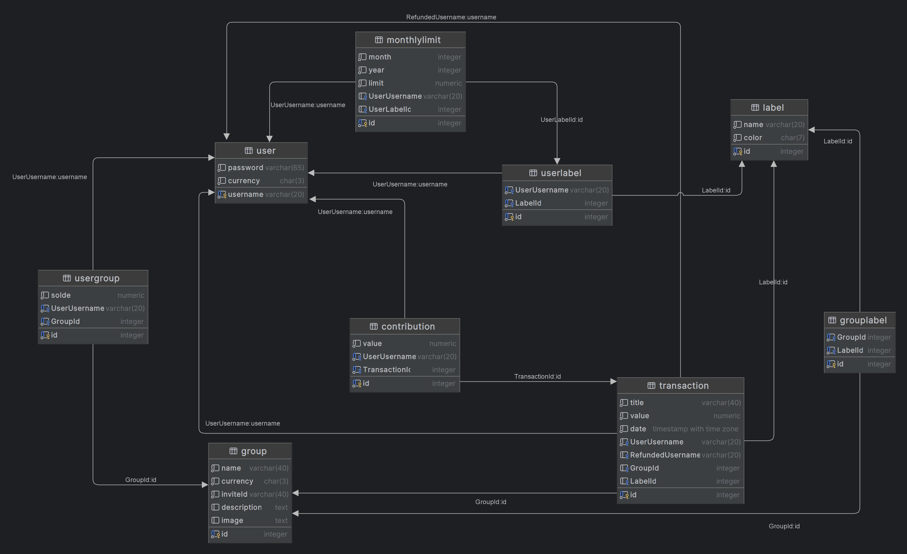

# Collabudget

  <summary>Table des matières</summary>
  <ol>
    <li>
      <a href="#Description">Description</a>
    </li>
    <li>
      <a href="#Etat-du-projet">Etat du projet</a>
    </li>
    <li><a href="#Structure-des-dossiers-principaux-du-projet">Structure des dossiers</a></li>
    <li>
      <a href="#comment-démarrer-le-projet-en-moins-de-15-minutes-en-local">Démarrer rapidement</a>
      <ul>
      <li><a href="#Cloner-le-projet">Cloner le projet</a></li>
        <li><a href="#Création-de-la-base-de-donnée">Création de la base de donnée</a></li>
        <li><a href="#Ajouter-les-fichiers-.env">Ajouter les fichiers .env</a></li>
        <li><a href="#Démarrer-les-projets">Démarrer les projets</a></li>
      </ul>
    </li>
    <li>
      <a href="#Contribution-au-projet ">Contribution au projet</a>
    </li>
    <li>
      <a href="#Contrainte-et-méthodologie-du-projet">Contrainte et méthodologie du projet</a>
    </li>
    <li>
      <a href="#Schéma-de-la-base-de-donnée">Schéma de la base de donnée</a>
    </li>
    <li>
      <a href="#Technologies-utilisées">Technologies uilisées</a>
    </li>
    
  </ol>

## Description
Lorsqu'on cherche à organiser notre budget il peut parfois être compliqué de tout rassembler au même endroit sans devoir entrer nos dépenses à double dans plusieurs applications. Si on a effectué des dépenses au sein d'un groupe d'amis il faut ensuite également ajouter cette dépense sur notre budget personnel ce qui peut être ennuyant.

Prenons l'exemple plus concret du voyage que vous organisez avec plusieurs amis, l'un va acheter les billets d'avions pour tout le monde, l'autre s'occuper de la réservation des chambres d'hôtels et peut être même qu'un autre va s'occuper de la plupart des dépenses de la nourriture sur place. Il vous suffit donc d'entrer chacune de ces dépenses dans notre application et vous saurez instantanément qui doit de l'argent et quelle somme est due sans devoir vérifier vous-même pour chaque dépense combien d'argent chaque personne vous doit.

Mais ce n'est pas là qu'on s'arrête ! Tout l'intérêt de notre application est que vous saurez personnellement combien vous avez dépensé dans ce groupe sur votre page personnel. Le but est tout de même de pouvoir maintenir votre propre budget mensuel à jour afin de savoir ou vous en êtes dans vos dépenses.

Collabudget est une application conçue pour simplifier la gestion de votre budget mensuel. Vous pouvez facilement enregistrer vos dépenses et il vous est également possible de spécifier une limite de dépense pour le mois courant. De plus, notre application vous offre également la possibilité de créer des groupes de partage de budgets avec vos amis, votre famille ou vos collègues facilitant ainsi la répartition équitables de vos finances. Les dépenses au sein de ces groupes sont ensuite automatiquement ajoutée sur votre profil personnel afin d'avoir un suivi des dépenses exactes et localisé dans une seule application.

## Etat du projet
Workflows

  [](https://github.com/Timerns/Collabudget/actions/workflows/ut_backend.yml)
  [](https://github.com/Timerns/Collabudget/actions/workflows/ut_frontend.yml)
  [](https://github.com/Timerns/Collabudget/actions/workflows/google_backend.yml)
  [](https://github.com/Timerns/Collabudget/actions/workflows/google_frontend.yml)

Issues


## Structure des dossiers principaux du projet
```
📦Collabudget
 ┣ 📂.github
 ┃ ┗ 📂workflows          # workflows git hub
 ┣ 📂backend              # Node backend code
 ┃ ┣ 📂app                # application backend
 ┃ ┣ 📂tests              # dossier des tests
 ┣ 📂deployment
 ┃ ┣ 📂backend
 ┃ ┗ 📂frontend
 ┗ 📂frontend             # Next.js app code
   ┣ 📂public
   ┣ 📂src
   ┃ ┗ 📂app             
   ┃   ┣ 📂(auth)         # route pour l'authentification
   ┃   ┣ 📂(landingpage)  # route pour la landing page
   ┃   ┣ 📂app            # route pour l'application
   ┃   ┣ 📂components     # composant react pour la réutilisation
   ┃   ┣ 📂types          # les types des objets
   ┃   ┗ 📂utils          # fonctions utilitaires
   ┗ 📂tests
```

## Comment démarrer le projet en moins de 15 minutes en local

### Cloner le projet

```
git clone https://github.com/Timerns/Collabudget.git
```


### Création de la base de donnée

Créer une base de donnée [postgresql](https://www.postgresql.org/download/) avec le nom que vous voulez. 

### Ajouter les fichiers .env

Le fichier .env sert à définir une variable d'environnement du projet fontend et backend. Il faut ajouter le fichier avec les variables d'environnement dans les deux dossiers le frontend et backend.

Exemple de fichier .env pour une configuration local:
```{bash}
DB_CS="postgres://<nom d'utilisateur>:<mot de pass>@localhost:5432/<nom de la db crée>"
EXPRESS_SECRET="secret aléatoire pour les cookies"
BACKEND="http://localhost:8000"
FRONTEND="http://localhost:3000"
```

⚠️ Si une des valeurs ci-dessus contient des caractères spéciaux (par exemple '\$') il faut les remplacer par leur versions hexadécimales (pour '\$' il faudra écrire '%24') ⚠️

### Démarrer les projets 

Pour démarrer le projet backend et frontend, il y a des prérequis. Il faut avoir installé  [node](https://nodejs.org/en/download) avec npm.  

Pour démarrer le projet backend, il faut ouvrir un terminal dans le dossier backend puis exécuter les commandes ci-dessous: 

```
npm install
```
```
npm run dev-local
```

De même pour le frontend, ouvrir un terminal dans le dossier frontend puis exécuter les commandes ci-dessous:

```
npm install
```
```
npm run dev-local
```

## Contribution au projet 

Pour contribuer au projet, quelques étapes à effectuer.  
La première consite à fork le projet GitHub, il faut ensuite créer une branche pour le développement de la feature et faire les modifications désirées.  
Une fois terminée il suffit de faire une pull request sur le projet d'origine et lors de celle-ci les tests unitaires seront executés automatiquement et au moment du merge dans la branche `main` le déploiement sera fait automatiquement sur Google cloud.

## Contrainte et méthodologie du projet 

Les informations complémentaires sur le projet se trouvent dans le fichier suivant : [README.md](./documentation/README.md)

Une grande partie de la collaboration se fait sur notre Discord.

[](https://discord.gg/RHBNRzvmy)

## Schéma de la base de donnée



## Technologies uilisées

 


 

  